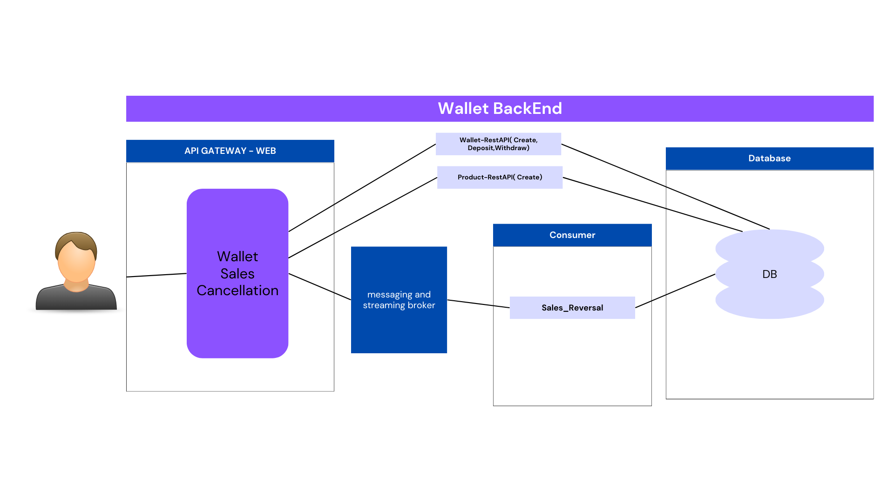

# Projeto Fintech V2 com mensageria  -API

*Características gerais do projeto:* 

* requests para servem importadas no postman se encontram na pasta `requests`*  

* projetos em Java 17 Spring para simular back-end de uma fintech

* API com Spring Boot

* Entidades com Jakarta Persistence

* Comunicação com o banco de dados MySQL via Docker

* Comunicação API externa via Spring Cloud OpenFeign  

* Validado  dados de entrada da API com Hibernate Validator

* Exceções  tratadas com ControllerAdvice e Problem Details (RFC 7807)

* Logs com o SLF4J

* TESTES UNITÁRIOS

Utilize o comando `docker compose up`  para  iniciar o container 

# *API's propostas*

* gateway-api 
* wallet-api
* product-api 
* sale-consumer-api 
* transfer-consumer-api 

  

# *Arquitetura Proposta*

